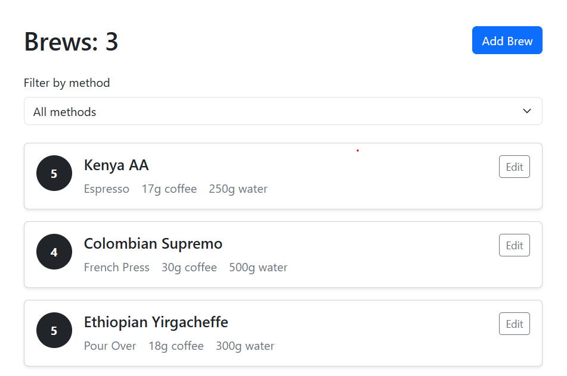
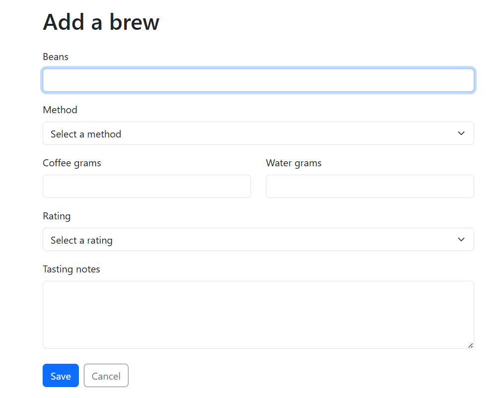
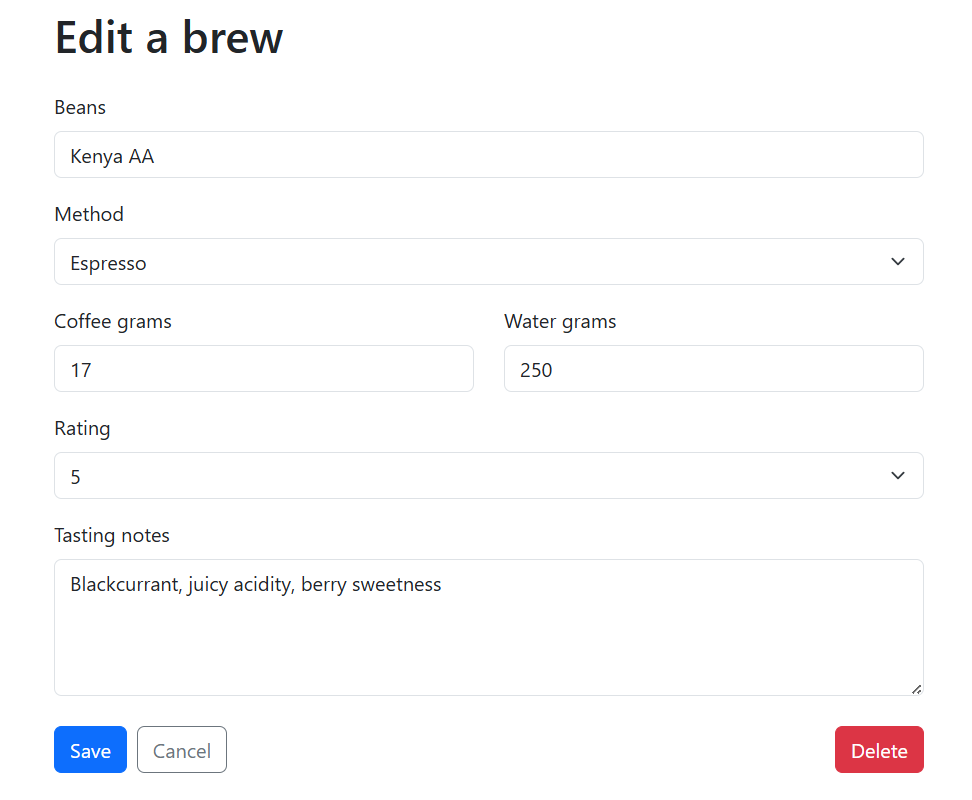

# ☕ Coffee Brew Log


A full-stack web application that allows users to record, manage, and organize coffee brewing sessions. Built with **React**, **Django REST Framework**, and **SQLite**, the application provides a responsive interface for creating, viewing, filtering, editing, and deleting brew entries through a RESTful API.


---

## 🚀 Live Demo

🌐 **Frontend:** https://coffee-brew-log.onrender.com

🔗 **Backend API:** https://coffee-brew-log-api.onrender.com/api/brews/

---

## 📸 Screenshots

### Home Page



### Add Brew



### Edit Brew



---

## ✨ Features

- Create new coffee brew entries
- View all saved brews
- Filter brews by brewing method
- Edit existing brews
- Delete brews
- Client-side and server-side validation
- Responsive user interface
- RESTful API architecture

---

## 🛠 Tech Stack

### Frontend

- React
- Vite
- Axios
- Bootstrap 5

### Backend

- Django
- Django REST Framework

### Database

- SQLite (Development)
- PostgreSQL (Production)

### Deployment

- Render

### Version Control

- Git
- GitHub

---

## ⚙️ Installation

### Clone the repository

```bash
git clone https://github.com/Sangiwe/coffee-brew-log.git
cd coffee-brew-log
```

### Backend Setup

```bash
cd backend

python -m venv venv

# Windows (Git Bash)
source venv/Scripts/activate

# Windows (Command Prompt)
venv\Scripts\activate

pip install -r requirements.txt

python manage.py migrate

python manage.py runserver
```

### Frontend Setup

Open another terminal.

```bash
cd frontend

npm install

npm run dev
```

---

## 📡 API Endpoints

| Method | Endpoint | Description |
|---------|----------|-------------|
| GET | `/api/brews/` | Retrieve all brews |
| POST | `/api/brews/` | Create a new brew |
| PUT | `/api/brews/<id>/` | Update an existing brew |
| DELETE | `/api/brews/<id>/` | Delete a brew |

---

## 📚 Documentation

Additional project documentation is available in:

- `Documentation.md`
- `deployment.md`

---

## 🌱 Future Improvements

- User authentication
- Search and sorting
- Brew analytics dashboard
- Dark mode

---

## 📖 What I Learned

This project strengthened my understanding of:

- Building RESTful APIs with Django REST Framework
- React component-based architecture
- CRUD application development
- Frontend-backend communication using Axios
- React state management
- Form validation
- API integration
- Deployment using Render
- Git and GitHub workflow

---

## 👩‍💻 Author

**Sangiwe Nkwanyana**

Aspiring Software Engineer passionate about backend development, full-stack development, and building technology that solves real-world problems.
